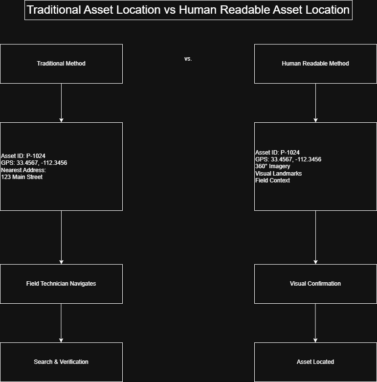

# Asset Address Problem

## Overview

Utilities can easily assign unique IDs to poles, transformers, valves, hydrants, and other infrastructure assets. The challenge is not identification. The challenge is location.

Street addresses work well for buildings but often fail for utility assets that may exist between addresses, behind structures, inside easements, or across large service territories.

This project explores the concept of the Asset Address Problem and investigates whether 360° imagery can function as a human-readable location system for utility infrastructure.

## Research Question

How can field personnel, engineers, and GIS professionals quickly locate a specific asset when traditional addressing systems are insufficient?

## Key Concepts

- Utility Asset Identification
- GIS Asset Management
- Human Readable Location Systems
- 360° Imagery
- Oriented Imagery
- Spatial Context
- Digital Twins

## Expected Deliverables

- Research article
- Supporting diagrams
- Example GIS workflows
- 360° imagery examples
- Location referencing concepts

## Figure 1: The Asset Address Problem

A utility asset may have a unique identifier but still lack a human-readable location reference. Traditional street addresses work for buildings but often fail for poles, transformers, hydrants, valves, and other distributed infrastructure assets.

### Why Existing Addresses Fail

- Assets often exist between street addresses.
- Assets may be located inside easements or rights-of-way.
- Multiple assets can share the same nearest address.
- GPS coordinates are precise but difficult for humans to communicate verbally.
- Field crews often rely on landmarks and visual context rather than coordinates alone.

### Proposed Solution

360° imagery provides something traditional addresses and coordinates cannot: visual context.

Instead of describing an asset as being located at a coordinate pair or near a street address, personnel can reference a location using imagery that captures what a person would actually see in the field.

When linked to GIS records, a 360° image can function as a human-readable location reference that complements asset IDs, GPS coordinates, and traditional asset management systems.

Potential advantages include:

- Faster asset discovery
- Reduced navigation errors
- Improved communication between office and field staff
- Better training and onboarding
- Enhanced support for digital twin environments

### Conceptual Workflow

```text
Asset ID
   ↓
GIS Database
   ↓
GPS Coordinates
   ↓
360° Imagery
   ↓
Human Readable Location Context
   ↓
Field Crew Navigation
```

## Figure 2: Traditional Address vs Human Readable Asset Location

| Traditional Location Method | Human Readable Location Method |
|----------------------------|--------------------------------|
| Asset ID | Asset ID |
| GPS Coordinates | GPS Coordinates |
| Nearest Street Address | 360° Imagery |
| Written Directions | Visual Landmarks |
| Map Reference | Field Context |
| Technician Interpretation | Immediate Recognition |
| Search & Verification | Visual Confirmation

## Figure 3: Traditional Asset Location vs Human Readable Asset Location



Comparison of traditional utility asset location methods and a human-readable location approach using imagery, visual landmarks, and field context.

## Example Scenario

A utility dispatcher receives a request to inspect transformer P-1024.

Using a traditional workflow, the technician receives an asset ID, GPS coordinates, and the nearest street address. The technician must interpret the information, navigate to the area, and verify the correct asset in the field.

Using a human-readable location workflow, the technician receives the same asset information along with imagery, visual landmarks, and field context. The technician can immediately recognize the asset location and confirm it visually before arriving on site.

This example demonstrates how imagery can complement traditional GIS asset records by providing location context that coordinates and addresses alone cannot easily communicate.

## Why Utility Assets Are Different

Unlike buildings, utility assets are often located between street addresses, inside easements, behind structures, or across large service territories.

A transformer, valve, hydrant, or power pole may have a unique asset identifier and precise GPS coordinates, but those references do not always provide the visual context needed for rapid field identification.

As a result, field personnel frequently rely on landmarks, local knowledge, and visual cues to locate infrastructure assets.

This creates an opportunity for imagery-based location systems to complement traditional GIS asset records by providing a human-readable representation of asset location.

## Why 360° Imagery Works

Traditional location methods communicate where an asset should be.

360° imagery communicates what the technician should expect to see.

Unlike coordinates or written directions, panoramic imagery preserves surrounding visual context including nearby structures, roads, vegetation, utility equipment, fences, access points, and landmarks. These environmental cues are often the information field personnel naturally use when locating infrastructure.

When linked to GIS asset records, a panoramic image becomes more than documentation. It becomes a visual reference that reduces interpretation, improves confidence, and accelerates asset verification.

Rather than replacing GIS coordinates, 360° imagery complements existing asset management systems by providing the human-readable context that numerical location references cannot communicate.
